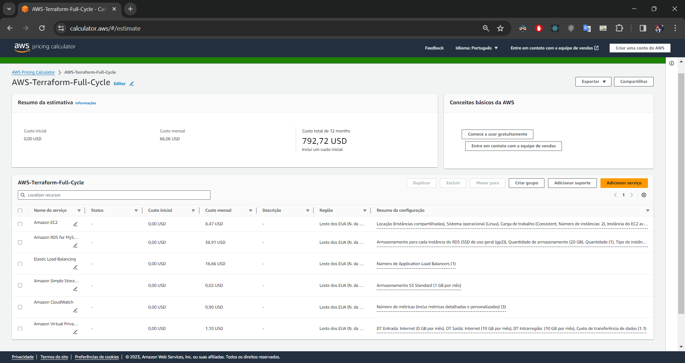
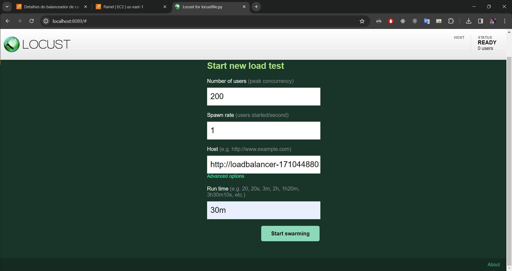
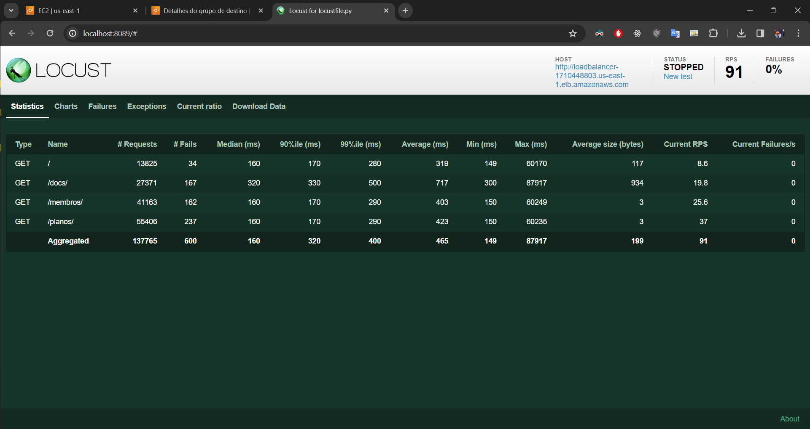
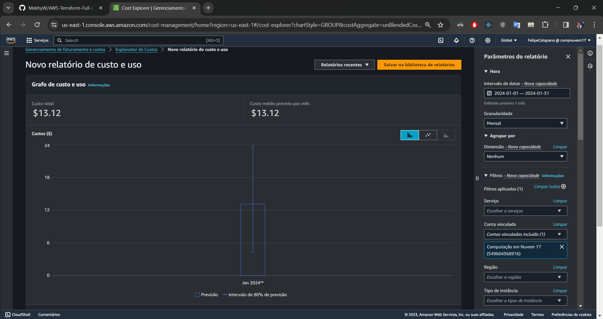

# Context

## Project scope

This project serves as a beginner-friendly example of how to use Terraform to deploy a simple CRUD API to an AWS environment, using services such as EC2, RDS and CloudWatch, in a way that is repeatable and easily scalable. It requires very little input from the user, and can be deployed and destroyed with a single command.

## Example application used

The application itself used is a FastAPI application that simulates a backend for a gym membership system, which holds data of members (name, phone number, etc.), plans (type, price, date of creation, etc.) and the subscriptions themselves (member, plan, start date, end date, etc.), in a MySQL database. It can be found at https://github.com/MekhyW/Gym-CRUD

We can suppose a hypothetical scenario where a gym business located in the United States uses a backend to serve several different applications, such as a mobile app for members, an internal app for employees, a website for the business, microsservices for other applications, etc. In this scenario, we suppose that the business chain is considerably successful and although the traffic average is not very high, there are several peaks of high traffic with hundreds of logged members simultaneously and thousands of requests per minute.


# Architecture in the cloud

## Diagram

The following diagram (made using the Brainboard tool https://www.brainboard.co/) shows the architecture created on AWS by the Terraform scripts:


## Technical decisions

### 

- **us-east-1 region**: The project is deployed in the us-east-1 region, chosen for its cost-effectiveness, as well as the fact that it is geographically closer to the physical locations of the fictitious gyms.

- **t2.micro EC2 instances**: The project utilizes the t2.micro instance for EC2 deployment. This instance type is optimized for applications that do not require high CPU performance, which is the case for the project's CRUD API. The choice of **General Purpose SSD (GP2)** storage with 8GB capacity surpasses the project's storage needs, offering scalability for potential future requirements.

- **db.t2.micro RDS instance with Multi-AZ**: The project utilizes the db.t2.micro instance for RDS deployment, for similar reasons as the EC2 instances, and with Multi-AZ enabled for high availability. Keep in mind that the database password is exposed for this simplified example, and should be stored in a more secure way in a real scenario.

- **Autoscaling with alarms**: CloudWatch is used to automatically trigger a scale up of the EC2 instances when the CPU utilization reaches 80% for 1 minute or it is receiving over 150 requests per second, and a scale down when it reaches 20% for 5 minutes. Up to 10 instances can be created, and it is guaranteed that at least 2 instances will be running at all times. This ensures that the application will be able to handle the expected load, while also minimizing costs by only using the necessary resources.

- **Official AMI**: The project uses the official Ubuntu Server 20.04 LTS (HVM), and installs all the necessary dependencies upon deployment, via a shell script. This ensures that the application will be running on a stable environment without the need for managing a custom AMI.

- **Virtual Private CLoud**: A VPC is used for security and isolation purposes. The VPC is divided into 2 subnets, one public and one private, making the application accessible from the internet while keeping the underlying components private.


# How to use

### Prerequisites

Before you start, ensure you have the following prerequisites installed:

1. [AWS CLI](https://aws.amazon.com/cli/): Install the AWS Command Line Interface.
2. [Terraform](https://www.terraform.io/): Install Terraform on your local machine.
3. [Locust](https://locust.io/): Install Locust for load testing.

### 1. AWS CLI Installation and Authentication

If you don't have an AWS account, [create one](https://aws.amazon.com/) and obtain your access key and secret key.

Install AWS CLI and configure it with your AWS credentials:

```bash
aws configure
```

### 2. Terraform Installation

Install Terraform on your local machine. You can find the installation instructions [here](https://learn.hashicorp.com/tutorials/terraform/install-cli).

### 3. Deploy S3 bucket

A subfolder named "s3" contains the Terraform scripts to deploy the S3 bucket. This bucket will be used to store the lock files used by Terraform to prevent concurrent modifications to the infrastructure.

```bash
cd s3
terraform init
terraform plan
terraform apply -auto-approve
```

### 4. Create DynamoDB Table

On the AWS console, create a DynamoDB table named "atfc-state-lock-table" with the primary key "LockID" of type String, by importing the bucket created in the previous step.

### 5. Deploy infrastructure

```bash
cd ..
terraform init
terraform plan
terraform apply -auto-approve
```
A few minutes after the apply command is completed, the infrastructure should be ready to use. Enter the DNS address of the load balancer in your browser to access the application.

### 6. Load testing

To test the application, we will use Locust. 
1) To start the Locust server, run the following command:

```bash
cd stress-test
locust
```

2) Access the Locust web interface at http://localhost:8089/
3) Set the number of users spawn rate and time limit, with the load balancer DNS address as the host. Don´t forget to include the "http://" prefix and remove trailing slashes.
4) Click on "Start swarming" and wait for the test to finish. The failure rate will be displayed in real time.

### 7. Destroy infrastructure

```bash
cd ..
terraform destroy -auto-approve
```


# Cost analysis

## Estimation using AWS calculator

The following diagram shows the estimated cost of the infrastructure, based on the AWS calculator https://calculator.aws/

Full estimate can be found [here](docs/estimated-cost.pdf).

## Real cost on worst expected load

In order to have a better understanding of the real cost of the infrastructure, Locust was used to simulate a worst expected case scenario (excluding DDOS attacks), with 200 users spawning at a rate of 1 new user per second, for 30 minutes.

Each simulated user made GET requests to **most available GET endpoints**, with different weights for each endpoint, at a random rate between 1 and 3 requests per second.



The results show a failure rate of approximately 0.4%, with a medium response time of 0.16 seconds. This is a very satisfactory result for a low-cost non-critical application.


The cost of the infrastructure during the test was the following:

This suggests a monthly cost of approximately **$ 400.00** if such peaks were to happen every single day.


# Suggested improvements

- **Serverless**: The application could be deployed using serverless technologies such as AWS Lambda, which would reduce costs and improve scalability.

- **Login system**: The application could be improved by adding a login system, which would allow the creation of multiple users with different permissions. AWS Congnito could be used for this purpose.

- **HTTPS**: The application is currently not using HTTPS, which is a security risk. This could be easily fixed by using a load balancer with an SSL certificate.

- **DDOS protection**: The application is not protected against DDOS attacks. This could be fixed with services such as AWS Shield, CloudFlare, fail2ban, etc.

- **Backup**: The database is not being backed up automatically. This could be fixed by using AWS Backup for example.